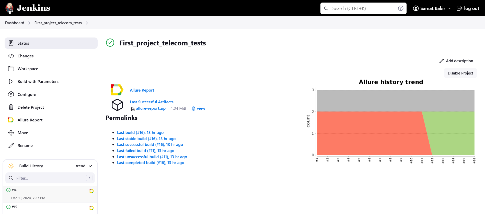
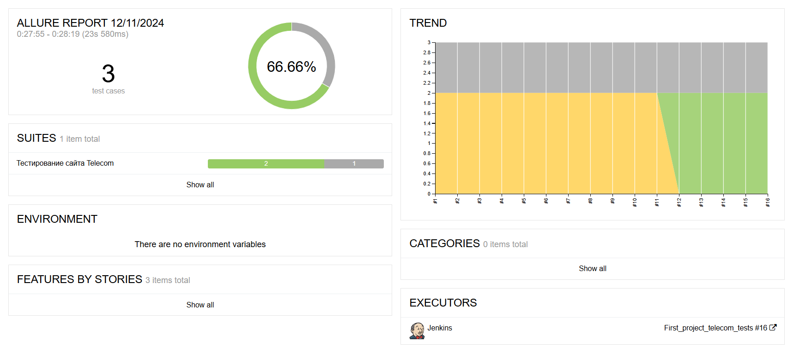
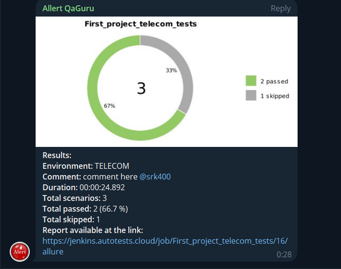

# 
[TELECOM.KZ](https://telecom.kz/ru/)

> АО «Казахтелеком» является крупнейшим оператором фиксированной телефонии в Казахстане, признанным лидером в предоставлении услуг связи, в том числе услуг связи сельской местности, а также одним из крупнейших операторов Национальной сети передачи данных.

---

## 
Содержание

- [Проект](#Проект)
- [Jenkins](#Jenkins)
- [Allure Report](#Allure-Report)
- [Telegram Report](#Telegram-Report)
- [Видео о прохождении тестов](#Видео-о-прохождении-тестов)

---

### 
Проект

> Целью проекта является задание на основе курса [QA GURU](https://qa.guru/)

- Написать автотесты
- Выложить проект на GitHub
- Создать задачу в Jenkins
- Вывести отчет в Allure
- Получить уведомление о прохождении тестов в Telegram Bot

#### Инструменты:

---

### 
Задача в [Jenkins](https://jenkins.autotests.cloud/job/First_project_telecom_tests/)

    

---

### 
Отчет о прохождении тестов в [Allure Report](https://jenkins.autotests.cloud/job/First_project_telecom_tests/allure/)

    

---

### 
Telegram Report

    

---

### 
Запись прохождения тестов

